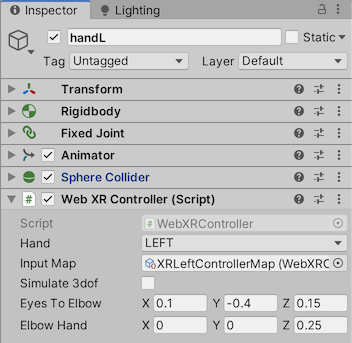
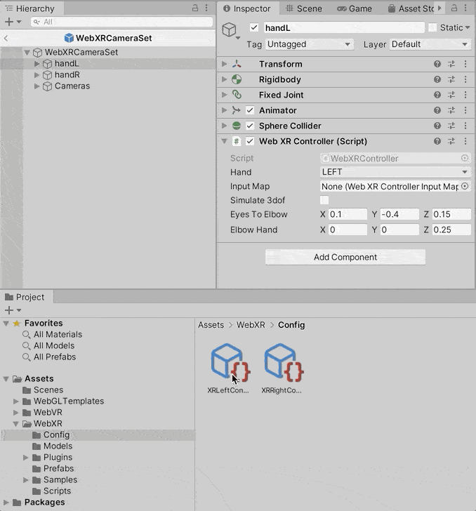
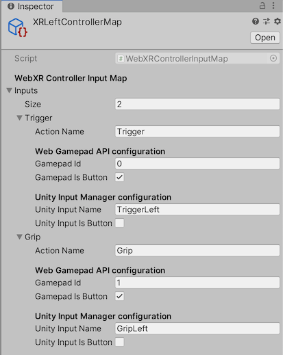

# Controllers and input system

Tracked controllers are by default included in `WebXRCameraSet` prefab when installed into your project scene. See [Project Setup](./project-setup.md#5-add-the-webxr-prefab-to-your-scene) on how to do this.

Out of the box, the prefab includes:

* Hand models
* Animations for hands when using grip and trigger buttons.
* Controller position and orientation tracking.
* Works with _PC, Mac and Linux Standalone_ and _WebXR_ platforms.
* Works with in-editor playback.


# WebXRController Script

Provides configuration for setting up GameObjects as controllers. The script also applies position and orientation tracking from VR controllers.



| Option | Description |
| --- | --- |
| Hand | GameObject tracked as Left or Right hand |
| Input Map | WebXRControllerInputMap asset used to configure Inputs from controllers |

# Cross platform support using WebXRControllerInputMap

Because we are working between two platforms, Unity (Editor and Standalone PC, Mac, Linux) and Web Browsers, we need a way to mediate between the two input systems, the [Unity Input Manager](https://docs.unity3d.com/Manual/xr_input.html) and [Browser Gamepad API](https://developer.mozilla.org/en-US/docs/Web/API/Gamepad_API/Using_the_Gamepad_API) respectively. To do this, we create `WebXRControllerInputMap` assets to configure _Actions_ that map to the respective inputs for each platform.

In the asset package, we include two pre-made assets, one for each hand: `XRLeftControllerMap.asset` and `XRRightControllerMap.asset`.  To use, _drag and drop_ the assets into `WebXRController` script `Input Map` option for the corresponding left or right hand.



# Configuring a WebXRControllerInputMap asset



| Option | Description |
| --- | --- |
| Action Name | Name describing gesture performed on controller |
| Gamepad Id | The Corresponding Gamepad API button or axis ID |
| Gamepad Is Button | Whether gesture derives its value from a Gamepad API `GamepadButton.pressed` property |
| Unity Input Name | Input name defined in Unity Input Manager |
| Unity Input Is Button | Whether gesture derives its value from Unity using `Input.GetButton` function |

As a note, we have two `WebXRControllerInputMap` assets, one for each hand since there is overlap between input ID's for browser Gamepad button and axis for each hand.

## Creating a new InputMap Asset

To create a new `WebXRControllerInputMap`, use `Asset > Create > Web XR Controller Input Map`

# Configure Unity Input Manager

To get up and running using pre-configured Input Manager settings, follow [Step #5, Add Input Manager Settings to your Project](project-setup.md#5-add-input-manager-settings-to-your-project) in the [Setting up a Unity project for WebVR](./project-setup.md) guide.

You can also choose to manually configure the Input Manager by using `Edit > Project Settings > Input`

Below is an example of Unity Input Manager _input axes_ that correspond to the _Unity Input Name_ in the `WebXRControllerInputMap` as [shown above](#configuring-a-webvrcontrollerinputmap-asset).


## Unity VR Input

See Unity VR Input specification for controller axis and button definitions for each VR system.   

* [Input for Editor and Standalone](https://docs.unity3d.com/Manual/XRPluginArchitecture.html)

## Gamepad API Input

Identify controller axis and button usage using the [HTML5 Gamepad Tester](http://html5gamepad.com/).

You will need to have WebXR active and rendering into the headset before controllers are visible. To test this, open [WebXR content](https://mixedreality.mozilla.org/hello-webxr/), or [HTML5 Gamepad Tester](http://html5gamepad.com/).


## How the WebXRController decides which Input platform to use.

Unity Input Manager (for button and axis) and XR Inputs (for position and orientation) is used when using in-editor playback or when building to PC, Mac & Linux compatible standalone.
* [In-editor VR playback for rapid testing](./xr-testing.md).

When your project is built to WebXR, the browser Gamepad API is used for input from VR controllers.
* [Building your project to WebXR](./project-setup#6-build-your-project-to-webxr).

## Using controller Inputs

The `WebXRController` Inputs are similar in use to the standard Unity Input system.

```c#
using UnityEngine;

public class ExampleClass : MonoBehaviour
{
    private WebXRController _controller;

    void Awake() {
        // Retrieve the WebXRController component.
        _controller = GetComponent<WebXRController>();
    }

    void Update() {
        // Controller hand being used.
        WebXRControllerHand hand = controller.hand;
        
        // GetButtonDown and GetButtonUp:
        if (controller.GetButtonDown("Trigger"))
            print(hand + " controller Trigger is down!");

        if (controller.GetButtonUp("Trigger"))
            print(hand + " controller Trigger is up!");
        
        // GetAxis:
        if (controller.GetAxis("Grip") > 0)
            print(hand + " controller Grip value: " + controller.GetAxis("Grip"));
    }
}
```
