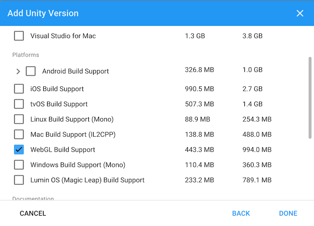
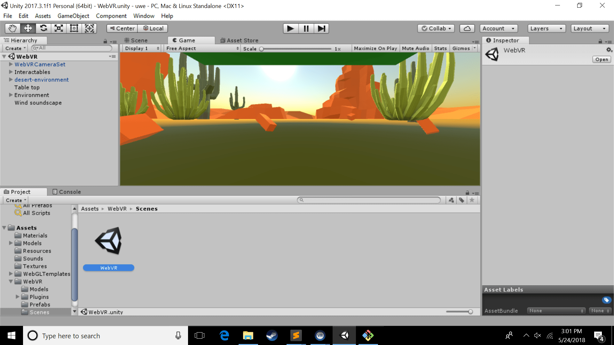
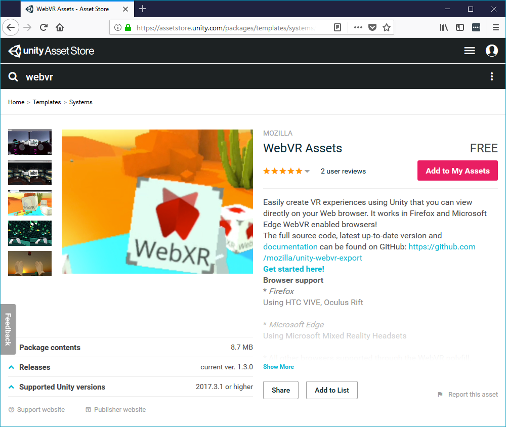
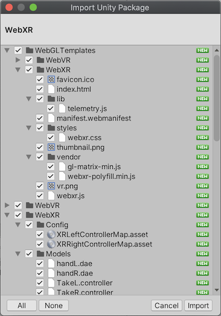
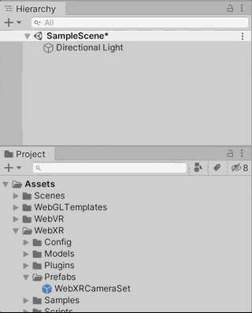

# Setting up a Unity project for WebXR

**There are two ways to start a WebVR enabled project using Unity.**

1. **[Download the example project](https://github.com/mozilla/unity-webvr-export/archive/master.zip).**

    This is the simplest option, to do this, [download the project](https://github.com/mozilla/unity-webvr-export/archive/master.zip) and open in Unity. You can follow steps from [step #7](#7-build-your-project-to-webvr) onwards to build the project to WebXR.

2. **[Start by Creating a new Unity 3D Project](#1-create-a-new-unity-3d-project).**

    In this tutorial, we cover option 2, starting from new, stepping through each step from creating a new Unity project, adding the WebXR Assets, then building to WebGL.

## 1. Create a new Unity 3D project.

Open an existing project, or click on the `New` button and fill in the details of the new game:

## 2. Ensure that WebGL platform support is installed.

Open the menus: `File > Build Settings`

If it isn't, use the Unity Hub to install it for your version of Unity.

## 3. Enable Virtual Reality support in Unity.

See [In-editor VR playback for rapid testing](./xr-testing.md) for full steps.

## 4. Download the assets from the Unity Asset store.

**[Unity Asset Store page](https://assetstore.unity.com/packages/templates/systems/webvr-assets-109152).**

Alternatively, download and install the [`WebXR-Assets.unitypackage`](https://github.com/mozilla/unity-webvr-export/raw/master/WebXR-Assets.unitypackage) from this repo and use (`Assets > Import Package > Custom Package`) to import the package into your project.

If you are not upgrading a project from an older version you can uncheck `/WebGLTemplates/WebVR` and `/WebVR`

## 5. Add the WebXR prefab to your scene.

Disable the standard default camera, so that it does not interfere with the cameras used in the WebXR prefab.

To do this, select `Main Camera` from the scene's `Hierarchy`; then, delete or disable the camera from the `Inspector`.

Add the `WebXRCameraSet` prefab (`Assets > WebXR > Prefabs > WebXRCameraSet.prefab`):

The prefab contains hand controllers, VR Camera setup and other components needed for your game to work with WebXR. 

## 6. Add Input Manager settings to your project.

This step is only needed for desktop platforms and the editor. If you don't need to support those, skip to step 7.

Copy [`InputManager.asset`](https://github.com/mozilla/unity-webvr-export/raw/master/ProjectSettings/InputManager.asset) into your Project `/ProjectSettings` folder.  This will add pre-configured Unity Input Manager input axes needed for controllers to work.

See [Controllers and Input System](./controllers.md) for more details about how this works.

## 7. Your Unity project is setup. Play to see the result!

## 8. Build your project to WebXR

### Select the WebXR template from player settings.

Go to `Edit > Project Settings > Player`:

### Build and run your project in the browser!

Click on `File > Build & Run`, select a destination folder and Unity will compile your code and and launch the game in your **default** browser. If you want to open the game in another browser, copy and paste the URL of the game.

Under the hood, when clicking `Build & Run`, Unity will place all the needed files in the selected folder and will spin up a development web server pointing there. If you want to provide your own server, choose `File > Build` instead.

